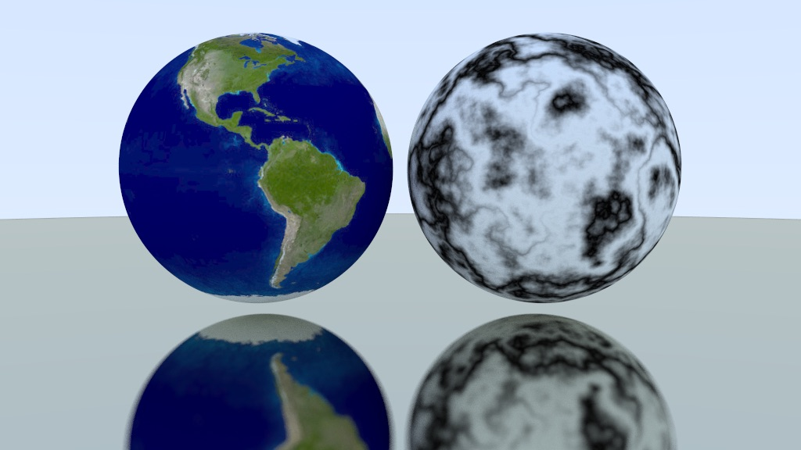

## Overview

A path tracer based on the [Raytracing in one weekend](https://raytracing.github.io/) book series.

The current feature set includes what is covered in the first and part of the second book with some additions:

- Geometry: Spheres.
- Materials: diffuse, metal and glass.
- Textures: Flat color, image texture, perlin noise.
- Camera: fov, focus distance, motion blur...
- Bounding volume hierarchy to speed up scene traversal.
- Integrated STB library to generate PNG image output.
- Multi threaded rendering.

The main executable has multiple scene samples which can be rendered at different quality presets: low, medium and high.

```raytracer --scene [SCENE_ID] --quality [low|medium|high]```

**Random spheres with materials**
<br/>


**Random spheres with materials + Ground texture and Motion blur**
<br />


**Textures**
<br />

