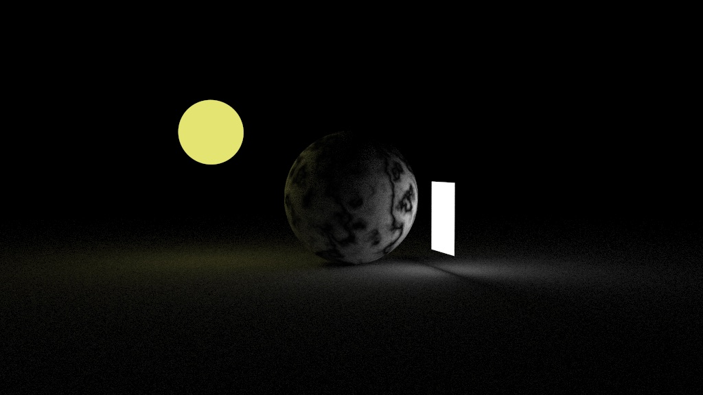
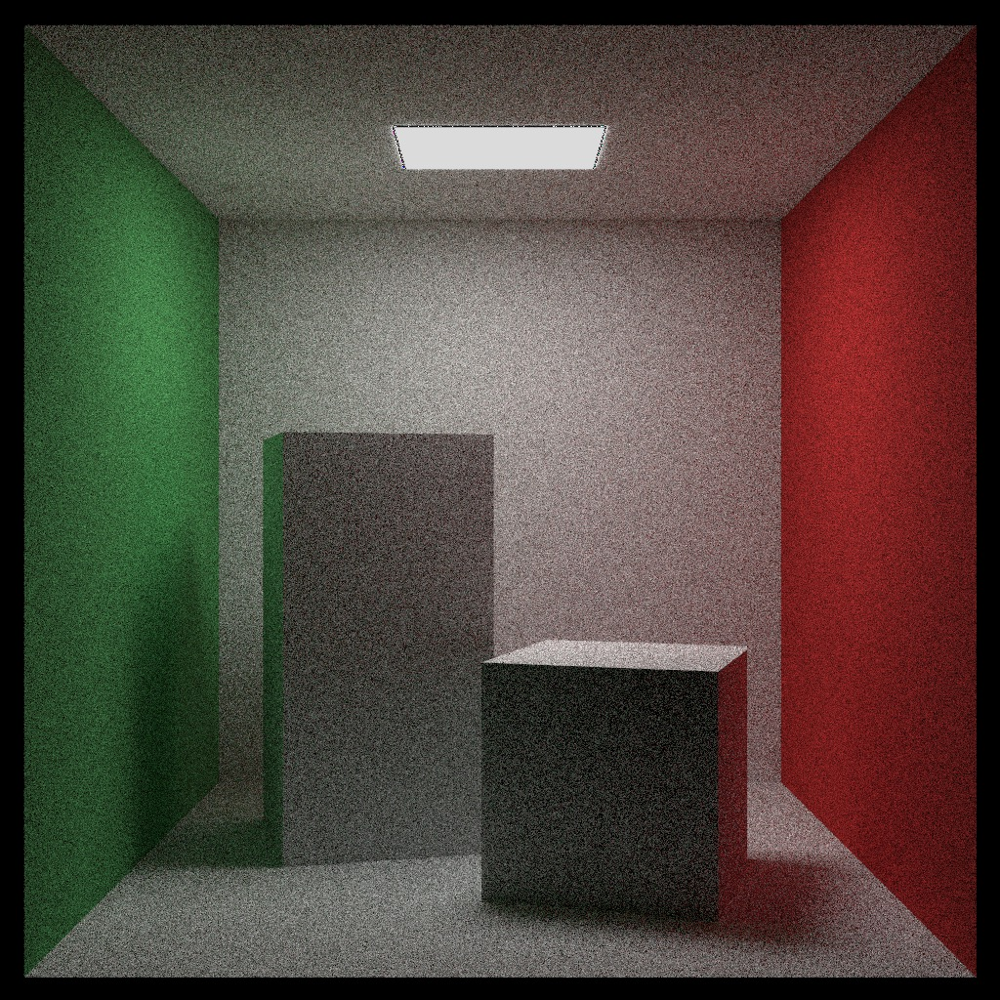

## Overview

A path tracer based on the [Raytracing in one weekend](https://raytracing.github.io/) book series.

The feature set includes what is covered in the first two books in the series:

- Geometry: Spheres, Rectangle and boxes.
- Materials (metal, glass...), multiple Texture types and Light sources.
- Configurable camera: fov, focus distance, motion blur...
- Bounding volume hierarchy to speed up scene traversal.

Additional features:
- Integrated STB library to generate PNG image output.
- Full 3D transforms using 4x4 matrices.
- Multi threaded rendering.

The main executable has multiple scene samples which can be rendered at different quality presets: low, medium and high.

```raytracer --scene [SCENE_ID] --quality [low|medium|high]```

**Materials and camera effects**
<br/>


**Light sources and textures**
<br />


<br />

