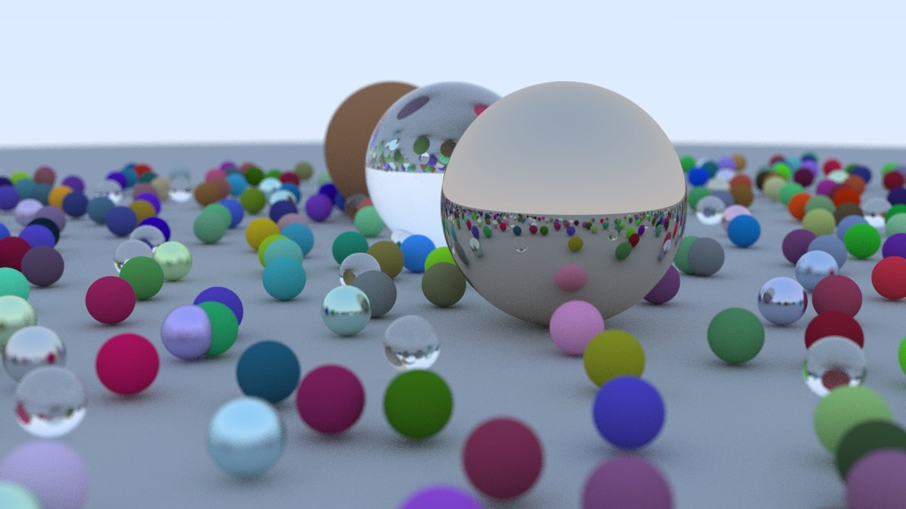
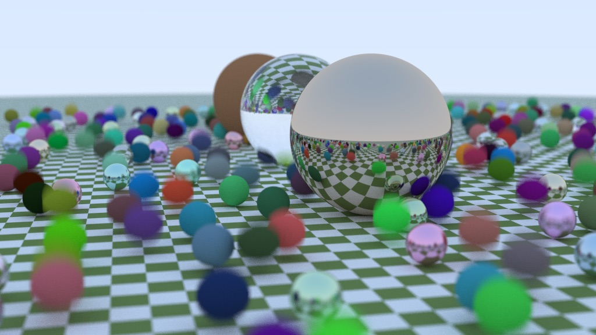

## Overview

A brute force path tracer based on the [Raytracing in one weekend](https://raytracing.github.io/) book series.

The current feature set includes what is covered in the first book in the series with some additions:

- Only supports Sphere geometry.
- Basic materials: diffuse, metal and glass.
- Camera properties: position, fov, focus distance...
- Integrated STB library to generate PNG image output.
- Multi threaded rendering.

 

 

